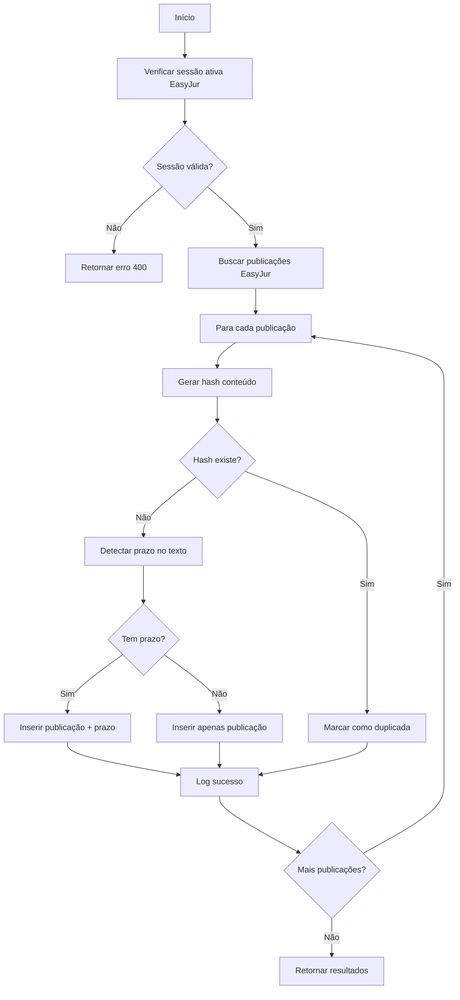

# Edge Functions - Documentação Técnica

## Visão Geral
Este documento detalha as Edge Functions implementadas para automação de processos jurídicos com integração ao EasyJur.

---

## 1. easyjur-auth

**Endpoint:** `POST https://orluznhdcrvnyfrjccbh.supabase.co/functions/v1/easyjur-auth`  
**Autenticação:** Não requerida (verify_jwt = false)

### Descrição
Gerencia autenticação e sessões com a plataforma EasyJur.

### Funcionalidades
- Login automático no EasyJur
- Verificação de sessões ativas
- Renovação de tokens expirados
- Logging de todas as operações de autenticação

### Request Body
```json
{
  "action": "login" | "check_session"
}
```

### Response
```json
{
  "success": true,
  "message": "string",
  "session": {
    "id": "uuid",
    "is_active": boolean,
    "expires_at": "timestamp",
    "last_login_at": "timestamp"
  }
}
```

### Secrets Utilizados
- `EASYJUR_USERNAME` - Usuário da conta EasyJur
- `EASYJUR_PASSWORD` - Senha da conta EasyJur

### Tabelas Modificadas
- `easyjur_sessions` - Armazena sessões ativas
- `easyjur_auth_logs` - Log de operações de autenticação

---

## 2. easyjur-sync-publicacoes

**Endpoint:** `POST https://orluznhdcrvnyfrjccbh.supabase.co/functions/v1/easyjur-sync-publicacoes`  
**Autenticação:** Não requerida (verify_jwt = false)

### Descrição
Sincroniza publicações do EasyJur com detecção inteligente de prazos e controle de duplicidades.

### Funcionalidades

#### ✅ Detecção de Duplicidades
- Gera hash único para cada publicação: `SHA(numero_processo + data_publicacao + texto_completo)`
- Verifica se hash já existe no banco antes de inserir
- Retorna contador de publicações duplicadas

#### ✅ Extração Automática de Prazos
Utiliza regex para identificar padrões no texto:
- `prazo\s+de\s+(\d+)\s+dias?` - Prazos genéricos
- `intima[çc][ãa]o.*?(\d+)\s+dias?` - Intimações  
- `cita[çc][ãa]o.*?(\d+)\s+dias?` - Citações

#### ✅ Criação de Prazos Processuais
Quando detecta prazo, cria automaticamente registro em `prazos_processuais`:
- `data_inicio` = data_publicacao
- `data_vencimento` = data_inicio + dias_prazo
- `status` = 'aberto'
- `prioridade` = 'alta'

#### ✅ Vinculação com Processos
- Busca processo correspondente pelo `numero_processo`
- Vincula publicação ao processo via `processo_id`
- Vincula prazo à publicação via `publicacao_id`

### Fluxo de Execução



### Request Body
Não requer body. Executa sincronização automática.

### Response
```json
{
  "success": true,
  "message": "Sincronização de publicações concluída",
  "results": {
    "total": 10,
    "novas": 8,
    "duplicadas": 2,
    "com_prazo": 5,
    "erros": 0
  }
}
```

### Secrets Utilizados
- `SUPABASE_URL` - URL do projeto Supabase
- `SUPABASE_SERVICE_ROLE_KEY` - Chave com privilégios elevados

### Tabelas Modificadas
- `publicacoes` - Insere novas publicações
- `prazos_processuais` - Cria prazos quando detectados
- `easyjur_auth_logs` - Log de cada operação

### Algoritmos Implementados

#### 1. Geração de Hash
```typescript
function createHash(content: string): string {
  const encoder = new TextEncoder();
  const data = encoder.encode(content);
  return Array.from(data)
    .map(b => b.toString(16).padStart(2, '0'))
    .join('')
    .substring(0, 64);
}

// Uso:
const hash = createHash(
  `${pub.numero_processo}${pub.data_publicacao}${pub.texto_completo}`
);
```

#### 2. Detecção de Prazo
```typescript
function detectarPrazo(texto: string): {
  tem_prazo: boolean;
  dias_prazo?: number;
  tipo_prazo?: string;
} {
  const prazoRegex = /prazo\s+de\s+(\d+)\s+dias?/gi;
  const intimacaoRegex = /intima[çc][ãa]o.*?(\d+)\s+dias?/gi;
  const citacaoRegex = /cita[çc][ãa]o.*?(\d+)\s+dias?/gi;
  
  // Tenta detectar prazo genérico
  let match = prazoRegex.exec(texto);
  if (match) {
    return {
      tem_prazo: true,
      dias_prazo: parseInt(match[1]),
      tipo_prazo: 'generico'
    };
  }
  
  // Tenta detectar intimação
  match = intimacaoRegex.exec(texto);
  if (match) {
    return {
      tem_prazo: true,
      dias_prazo: parseInt(match[1]),
      tipo_prazo: 'intimacao'
    };
  }
  
  // Tenta detectar citação
  match = citacaoRegex.exec(texto);
  if (match) {
    return {
      tem_prazo: true,
      dias_prazo: parseInt(match[1]),
      tipo_prazo: 'citacao'
    };
  }
  
  return { tem_prazo: false };
}
```

#### 3. Cálculo de Data de Vencimento
```typescript
function calcularDataVencimento(dataInicio: string, diasPrazo: number): string {
  const data = new Date(dataInicio);
  data.setDate(data.getDate() + diasPrazo);
  return data.toISOString().split('T')[0];
}

// Nota: Versão atual não considera feriados
// Implementação futura incluirá consulta à tabela 'feriados'
```

### Exemplo de Uso

#### Via Frontend (React)
```typescript
import { supabase } from '@/integrations/supabase/client';

async function sincronizarPublicacoes() {
  const { data, error } = await supabase.functions.invoke(
    'easyjur-sync-publicacoes'
  );
  
  if (error) {
    console.error('Erro na sincronização:', error);
    return;
  }
  
  console.log('Resultados:', data.results);
  // {
  //   total: 10,
  //   novas: 8,
  //   duplicadas: 2,
  //   com_prazo: 5,
  //   erros: 0
  // }
}
```

#### Via cURL
```bash
curl -X POST \
  https://orluznhdcrvnyfrjccbh.supabase.co/functions/v1/easyjur-sync-publicacoes \
  -H "Content-Type: application/json" \
  -H "apikey: YOUR_ANON_KEY"
```

### Logs e Monitoramento

Cada operação gera log em `easyjur_auth_logs`:

```sql
-- Ver logs de sincronização recentes
SELECT 
  action,
  status,
  details,
  created_at
FROM easyjur_auth_logs
WHERE action = 'sync_publicacao'
ORDER BY created_at DESC
LIMIT 20;
```

### Tratamento de Erros

#### Erro: Sessão Inativa
```json
{
  "success": false,
  "error": "Nenhuma sessão ativa do EasyJur. Faça login primeiro."
}
```
**Solução:** Executar `easyjur-auth` com `action: "login"`

#### Erro: Processo Não Encontrado
- Publicação é inserida normalmente
- `processo_id` fica `null`
- Pode ser vinculado manualmente depois

#### Erro: Inserção de Publicação
- Incrementa contador `results.erros`
- Gera log de erro em `easyjur_auth_logs`
- Continua processando próximas publicações

---

## 3. importar-feriados

**Endpoint:** `POST https://orluznhdcrvnyfrjccbh.supabase.co/functions/v1/importar-feriados`  
**Autenticação:** Não requerida (verify_jwt = false)

### Descrição
Importa automaticamente feriados nacionais brasileiros da BrasilAPI para a tabela de feriados.

### Funcionalidades

#### ✅ Importação Automática de Feriados
- Busca feriados da API pública BrasilAPI (https://brasilapi.com.br)
- Suporta qualquer ano (padrão: ano atual)
- Detecta e evita duplicidades por data
- Classifica automaticamente como feriados nacionais

#### ✅ Controle de Duplicidades
- Verifica se o feriado já existe antes de inserir
- Evita registros duplicados por data e tipo
- Retorna contador de novos vs duplicados

#### ✅ Logging Detalhado
- Registra cada feriado importado
- Lista erros específicos
- Retorna estatísticas completas

### Request Body
```json
{
  "ano": 2025,
  "estado": "CE"
}
```

**Parâmetros:**
- `ano` (opcional): Ano para importar feriados. Padrão: ano atual
- `estado` (opcional): Sigla do estado para associar aos feriados

### Response
```json
{
  "success": true,
  "message": "Importação de feriados do ano 2025 concluída",
  "results": {
    "total": 12,
    "novos": 12,
    "duplicados": 0,
    "erros": 0,
    "feriados_importados": [
      "Confraternização Universal (2025-01-01)",
      "Carnaval (2025-03-04)",
      "Sexta-feira Santa (2025-04-18)",
      "...mais feriados..."
    ]
  }
}
```

### Secrets Utilizados
- `SUPABASE_URL` - URL do projeto Supabase
- `SUPABASE_SERVICE_ROLE_KEY` - Chave com privilégios elevados

### Tabelas Modificadas
- `feriados` - Insere novos feriados nacionais

### Exemplo de Uso

#### Via Frontend (React)
```typescript
import { supabase } from '@/integrations/supabase/client';

async function importarFeriados(ano: number = new Date().getFullYear()) {
  const { data, error } = await supabase.functions.invoke(
    'importar-feriados',
    {
      body: { ano }
    }
  );
  
  if (error) {
    console.error('Erro na importação:', error);
    return;
  }
  
  console.log('Resultados:', data.results);
  // {
  //   total: 12,
  //   novos: 12,
  //   duplicados: 0,
  //   erros: 0,
  //   feriados_importados: [...]
  // }
}
```

#### Via cURL
```bash
curl -X POST \
  https://orluznhdcrvnyfrjccbh.supabase.co/functions/v1/importar-feriados \
  -H "Content-Type: application/json" \
  -H "apikey: YOUR_ANON_KEY" \
  -d '{"ano": 2025}'
```

### Agendamento Automático (✅ IMPLEMENTADO)

O sistema está configurado para importar feriados automaticamente todo dia 1º de janeiro às 6h da manhã.

**Detalhes do Cron Job:**
- **Nome**: `importar-feriados-anual`
- **Agendamento**: `0 6 1 1 *` (Todo dia 1º de janeiro às 6h)
- **Ação**: Chama a edge function `importar-feriados` passando o ano atual
- **Extensões**: Usa `pg_cron` e `pg_net` do Supabase

**Como funciona:**
1. Todo dia 1º de janeiro às 6h, o cron job é acionado
2. Faz uma requisição HTTP POST para a edge function
3. Passa automaticamente o ano atual como parâmetro
4. A função busca e importa todos os feriados nacionais do ano

**Gerenciar Cron Jobs:**
```sql
-- Listar todos os cron jobs
SELECT * FROM cron.job;

-- Desativar o agendamento automático
SELECT cron.unschedule('importar-feriados-anual');

-- Reativar o agendamento (se desativado)
SELECT cron.schedule(
  'importar-feriados-anual',
  '0 6 1 1 *',
  $$
  SELECT net.http_post(
    url:='https://orluznhdcrvnyfrjccbh.supabase.co/functions/v1/importar-feriados',
    headers:='{"Content-Type": "application/json", "apikey": "YOUR_ANON_KEY"}'::jsonb,
    body:=concat('{"ano": ', EXTRACT(YEAR FROM NOW()), '}')::jsonb
  ) as request_id;
  $$
);
```

### Fonte de Dados

**BrasilAPI** - API pública e gratuita de feriados nacionais brasileiros
- URL: https://brasilapi.com.br/api/feriados/v1/{ano}
- Não requer autenticação
- Retorna feriados nacionais oficiais
- Dados atualizados e confiáveis

### Limitações

1. **Apenas Feriados Nacionais**: A BrasilAPI fornece apenas feriados nacionais. Feriados estaduais e municipais devem ser inseridos manualmente ou de outras fontes.

2. **Feriados Móveis**: A API já calcula automaticamente feriados móveis (Carnaval, Páscoa, Corpus Christi).

3. **Anos Futuros**: A API suporta anos futuros com feriados já calculados.

### Tratamento de Erros

#### Erro: API Indisponível
```json
{
  "success": false,
  "error": "Erro ao buscar feriados da API: 503 Service Unavailable",
  "details": "Verifique se a API BrasilAPI está disponível e se o ano é válido"
}
```
**Solução:** Tentar novamente mais tarde ou verificar status da BrasilAPI

#### Erro: Ano Inválido
```json
{
  "success": false,
  "error": "Erro ao buscar feriados da API: 404 Not Found"
}
```
**Solução:** Verificar se o ano é válido e suportado pela API

---

## Melhorias Futuras

### 1. Cálculo de Prazos com Feriados
```typescript
// Implementação planejada
function calcularDataVencimentoComFeriados(
  dataInicio: string,
  diasPrazo: number
): string {
  // 1. Buscar feriados da tabela
  const feriados = await supabase
    .from('feriados')
    .select('data')
    .gte('data', dataInicio);
  
  // 2. Contar apenas dias úteis
  let diasContados = 0;
  let dataAtual = new Date(dataInicio);
  
  while (diasContados < diasPrazo) {
    dataAtual.setDate(dataAtual.getDate() + 1);
    
    // Pular finais de semana
    if (dataAtual.getDay() === 0 || dataAtual.getDay() === 6) {
      continue;
    }
    
    // Pular feriados
    if (isFeriado(dataAtual, feriados)) {
      continue;
    }
    
    diasContados++;
  }
  
  return dataAtual.toISOString().split('T')[0];
}
```

### 2. IA para Extração de Dados
```typescript
// Usar LLM para análise mais precisa
async function analisarPublicacaoComIA(texto: string) {
  const prompt = `
    Analise a seguinte publicação judicial e extraia:
    - Tipo de prazo (contestação, recurso, etc.)
    - Quantidade de dias
    - Partes envolvidas
    - Decisão principal
    
    Texto: ${texto}
  `;
  
  const resultado = await chamarLLM(prompt);
  return JSON.parse(resultado);
}
```

### 3. Agendamento Automático (Cron)
```sql
-- Executar sincronização diariamente às 8h
SELECT cron.schedule(
  'sync-publicacoes-diario',
  '0 8 * * *',
  $$
  SELECT net.http_post(
    url:='https://orluznhdcrvnyfrjccbh.supabase.co/functions/v1/easyjur-sync-publicacoes',
    headers:='{"apikey": "YOUR_ANON_KEY"}'::jsonb
  ) as request_id;
  $$
);
```

---

## Segurança

### RLS Policies
Todas as tabelas utilizadas possuem RLS habilitado:

```sql
-- Apenas service_role pode acessar
CREATE POLICY "Service role access"
ON publicacoes
FOR ALL
TO service_role
USING (true)
WITH CHECK (true);
```

### Secrets Management
- Credenciais armazenadas em Supabase Secrets
- Nunca expostas no código frontend
- Acessíveis apenas via edge functions

### Rate Limiting
- Implementar throttling para evitar sobrecarga
- Respeitar limites da API EasyJur

---

## Troubleshooting

### Problema: Duplicatas não sendo detectadas
**Causa:** Hash diferente devido a espaços/caracteres especiais  
**Solução:** Normalizar texto antes de gerar hash
```typescript
function normalizeText(text: string): string {
  return text.trim().toLowerCase().replace(/\s+/g, ' ');
}
```

### Problema: Prazos não sendo detectados
**Causa:** Variações de escrita não cobertas pelo regex  
**Solução:** Expandir padrões regex ou usar IA

### Problema: Data de vencimento incorreta
**Causa:** Feriados não sendo considerados  
**Solução:** Implementar cálculo com tabela de feriados

---

## Referências

- [Supabase Edge Functions](https://supabase.com/docs/guides/functions)
- [Deno Runtime](https://deno.land/)
- [Código de Processo Civil - Arts. 219-231](http://www.planalto.gov.br/ccivil_03/_ato2015-2018/2015/lei/l13105.htm)
