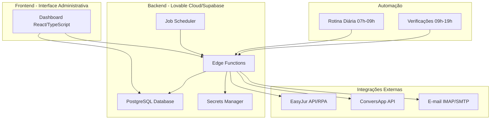

# ESPECIFICAÇÃO TÉCNICA - SISTEMA DE AUTOMAÇÃO JURÍDICA
## RDM Advogados Associados

---

## 1. VISÃO GERAL DA ARQUITETURA

### 1.1 Objetivo
Sistema de automação para rotinas administrativas de escritório de advocacia, integrando EasyJur, ConversApp e e-mail corporativo para automatizar leitura de publicações, cálculo de prazos, notificações a clientes e gestão de tarefas.

### 1.2 Princípios Arquiteturais
- **Segurança por Design**: Proteção de dados sensíveis e credenciais
- **Conformidade Legal**: LGPD, Estatuto da OAB e Código de Ética
- **Auditabilidade**: Trilha completa de operações automatizadas
- **Resiliência**: Tratamento de erros e fallbacks
- **Escalabilidade**: Preparado para crescimento de volume

### 1.3 Arquitetura de Alto Nível



---

## 2. MÓDULOS DO SISTEMA

### 2.1 MÓDULO DE AUTENTICAÇÃO E ACESSO AO EASYJUR

#### 2.1.1 Objetivo
Estabelecer e manter sessão autenticada no EasyJur para execução de rotinas automatizadas.

#### 2.1.2 Cenários de Integração

**Cenário A: API Oficial Disponível**
- Autenticação via endpoint oficial
- Token JWT ou similar
- Renovação automática de sessão

**Cenário B: Sem API Oficial (RPA)**
- Automação via Playwright/Puppeteer
- Login programático em https://app.easyjur.com/acesso/login.php
- Gestão de cookies e sessão

#### 2.1.3 Fluxo de Autenticação

```typescript
// Pseudocódigo
interface EasyJurAuthConfig {
  username: string; // {{USUARIO_EASYJUR}} - variável de ambiente
  password: string; // {{SENHA_EASYJUR}} - variável de ambiente
  sessionTimeout: number;
}

async function authenticateEasyJur(config: EasyJurAuthConfig): Promise<Session> {
  // 1. Verificar se existe sessão válida
  const existingSession = await getStoredSession();
  if (existingSession && !isExpired(existingSession)) {
    return existingSession;
  }
  
  // 2. Realizar novo login
  const session = await performLogin(config);
  
  // 3. Armazenar sessão de forma segura
  await storeSession(session);
  
  // 4. Configurar renovação automática
  scheduleSessionRenewal(session, config);
  
  return session;
}

async function performLogin(config: EasyJurAuthConfig): Promise<Session> {
  // Cenário A: API
  if (EASYJUR_API_AVAILABLE) {
    return await loginViaAPI(config);
  }
  
  // Cenário B: RPA
  return await loginViaRPA(config);
}
```

#### 2.1.4 Armazenamento Seguro de Credenciais
- **Nunca** codificar credenciais no código-fonte
- Utilizar Supabase Secrets Manager
- Variáveis de ambiente: `EASYJUR_USERNAME`, `EASYJUR_PASSWORD`
- Criptografia em repouso

#### 2.1.5 Gestão de Sessão
- Timeout padrão: 4 horas (ajustável)
- Renovação automática antes da expiração
- Detecção de logout forçado
- Retry com backoff exponencial em caso de falha

#### 2.1.6 Conformidade com Termos de Uso
- Respeitar rate limits do EasyJur
- Identificar agente como automação do escritório
- Não realizar scraping agressivo
- Documentar base legal (Termo de Uso vigente em {{DATA_TERMO_USO}})

#### 2.1.7 Modelo de Dados

```sql
-- Tabela de sessões EasyJur
CREATE TABLE easyjur_sessions (
  id UUID PRIMARY KEY DEFAULT gen_random_uuid(),
  session_token TEXT NOT NULL,
  expires_at TIMESTAMP WITH TIME ZONE NOT NULL,
  created_at TIMESTAMP WITH TIME ZONE DEFAULT now(),
  last_refreshed_at TIMESTAMP WITH TIME ZONE,
  is_active BOOLEAN DEFAULT true,
  metadata JSONB
);

CREATE INDEX idx_easyjur_sessions_active ON easyjur_sessions(is_active, expires_at);
```

---

### 2.2 MÓDULO DE LEITURA DE PUBLICAÇÕES E INTIMAÇÕES

#### 2.2.1 Objetivo
Ler diariamente publicações e intimações do EasyJur, extrair metadados e armazenar para processamento.

#### 2.2.2 Fluxo de Leitura

```typescript
interface Publicacao {
  id: string;
  numeroProcesso: string;
  tribunal: string;
  vara: string;
  partes: {
    autor: string;
    reu: string;
  };
  tipoAto: string;
  textoCompleto: string;
  dataPublicacao: Date;
  dataLeitura: Date;
  status: 'pendente' | 'lida' | 'notificada';
  hashUnico: string; // Para detecção de duplicidade
}

async function lerPublicacoesDiarias(): Promise<Publicacao[]> {
  // 1. Autenticar no EasyJur
  const session = await authenticateEasyJur();
  
  // 2. Acessar painel de publicações
  const painelUrl = 'https://app.easyjur.com/publicacoes'; // URL fictícia
  const page = await navigateTo(painelUrl, session);
  
  // 3. Extrair publicações não lidas
  const publicacoesRaw = await extractPublicacoes(page);
  
  // 4. Processar e normalizar dados
  const publicacoes = publicacoesRaw.map(pub => normalizePublicacao(pub));
  
  // 5. Verificar duplicidade
  const publicacoesUnicas = await filterDuplicatas(publicacoes);
  
  // 6. Armazenar no banco de dados
  await storePublicacoes(publicacoesUnicas);
  
  return publicacoesUnicas;
}

function normalizePublicacao(raw: any): Publicacao {
  return {
    id: generateUUID(),
    numeroProcesso: extractNumeroProcesso(raw.texto),
    tribunal: extractTribunal(raw.texto),
    vara: extractVara(raw.texto),
    partes: extractPartes(raw.texto),
    tipoAto: classifyTipoAto(raw.texto),
    textoCompleto: raw.texto,
    dataPublicacao: parseDate(raw.data),
    dataLeitura: new Date(),
    status: 'pendente',
    hashUnico: generateHash(raw.texto + raw.data)
  };
}
```

#### 2.2.3 Extração de Metadados

**Número do Processo**
- Regex: `\d{7}-\d{2}\.\d{4}\.\d\.\d{2}\.\d{4}`
- Exemplo: `0001234-56.2024.8.16.0001`

**Tribunal**
- Lista de tribunais brasileiros (TJMA, STJ, TST, etc.)
- Extração via keywords

**Tipo de Ato**
- Intimação
- Publicação de Sentença
- Despacho
- Acórdão
- Citação

#### 2.2.4 Modelo de Dados

```sql
CREATE TABLE publicacoes (
  id UUID PRIMARY KEY DEFAULT gen_random_uuid(),
  numero_processo VARCHAR(50) NOT NULL,
  tribunal VARCHAR(20) NOT NULL,
  vara VARCHAR(100),
  autor TEXT,
  reu TEXT,
  tipo_ato VARCHAR(50) NOT NULL,
  texto_completo TEXT NOT NULL,
  data_publicacao DATE NOT NULL,
  data_leitura TIMESTAMP WITH TIME ZONE DEFAULT now(),
  status VARCHAR(20) DEFAULT 'pendente',
  hash_unico VARCHAR(64) UNIQUE NOT NULL,
  metadata JSONB,
  created_at TIMESTAMP WITH TIME ZONE DEFAULT now(),
  updated_at TIMESTAMP WITH TIME ZONE DEFAULT now()
);

CREATE INDEX idx_publicacoes_processo ON publicacoes(numero_processo);
CREATE INDEX idx_publicacoes_status ON publicacoes(status);
CREATE INDEX idx_publicacoes_data ON publicacoes(data_publicacao DESC);
CREATE INDEX idx_publicacoes_hash ON publicacoes(hash_unico);

-- Trigger para updated_at
CREATE TRIGGER update_publicacoes_updated_at
  BEFORE UPDATE ON publicacoes
  FOR EACH ROW
  EXECUTE FUNCTION update_updated_at_column();
```

---

### 2.3 MÓDULO DE CÁLCULO E CADASTRO DE PRAZOS PROCESSUAIS

#### 2.3.1 Objetivo
Calcular automaticamente prazos processuais com base em publicações, aplicando regras do CPC, CPP e CLT.

#### 2.3.2 Regras de Cálculo

**Base Legal**
- CPC/2015: Arts. 219-231 (Contagem de prazos)
- CPP: Arts. 798-806
- CLT: Art. 775

**Regras Gerais (CPC)**
- Prazos em dias corridos ou úteis conforme definição legal
- Não correm em feriados, finais de semana (quando em dias úteis)
- Início: dia seguinte à publicação/intimação
- Fim: no final do expediente forense

**Tipos de Prazo**
- Contestação: 15 dias úteis (CPC Art. 335)
- Recurso de Apelação: 15 dias úteis (CPC Art. 1.003)
- Contrarrazões: 15 dias úteis após intimação do recurso
- Impugnação ao cumprimento de sentença: 15 dias úteis

#### 2.3.3 Implementação

```typescript
interface ConfiguracaoPrazo {
  tipoProcesso: 'civel' | 'penal' | 'trabalhista';
  tipoAto: string;
  dataPublicacao: Date;
  tabelaFeriados: Date[];
  regimePrazo: 'corridos' | 'uteis';
}

interface Prazo {
  id: string;
  publicacaoId: string;
  numeroProcesso: string;
  tipoPrazo: string;
  dataInicio: Date;
  dataFim: Date;
  diasUteis: number;
  baseLegal: string;
  status: 'aberto' | 'cumprido' | 'vencido';
}

function calcularPrazo(config: ConfiguracaoPrazo): Prazo {
  // 1. Determinar tipo de prazo baseado no ato
  const tipoPrazo = identificarTipoPrazo(config.tipoAto);
  
  // 2. Obter quantidade de dias do prazo
  const quantidadeDias = obterQuantidadeDias(tipoPrazo, config.tipoProcesso);
  
  // 3. Calcular data de início (dia seguinte à publicação)
  const dataInicio = addDays(config.dataPublicacao, 1);
  
  // 4. Calcular data de fim considerando feriados
  let dataFim: Date;
  if (config.regimePrazo === 'uteis') {
    dataFim = addDiasUteis(dataInicio, quantidadeDias, config.tabelaFeriados);
  } else {
    dataFim = addDays(dataInicio, quantidadeDias);
  }
  
  // 5. Retornar prazo calculado
  return {
    id: generateUUID(),
    publicacaoId: config.publicacaoId,
    numeroProcesso: config.numeroProcesso,
    tipoPrazo,
    dataInicio,
    dataFim,
    diasUteis: quantidadeDias,
    baseLegal: obterBaseLegal(tipoPrazo, config.tipoProcesso),
    status: 'aberto'
  };
}

function addDiasUteis(dataInicio: Date, dias: number, feriados: Date[]): Date {
  let diasContados = 0;
  let dataAtual = new Date(dataInicio);
  
  while (diasContados < dias) {
    dataAtual = addDays(dataAtual, 1);
    
    // Pular finais de semana
    if (isWeekend(dataAtual)) continue;
    
    // Pular feriados
    if (isFeriado(dataAtual, feriados)) continue;
    
    diasContados++;
  }
  
  return dataAtual;
}

// Tabela de referência de prazos
const PRAZOS_CPC: Record<string, { dias: number; baseAlegal: string }> = {
  'contestacao': { dias: 15, baseAlegal: 'CPC Art. 335' },
  'recurso_apelacao': { dias: 15, baseAlegal: 'CPC Art. 1.003' },
  'contrarrazoes': { dias: 15, baseAlegal: 'CPC Art. 1.010' },
  'impugnacao': { dias: 15, baseAlegal: 'CPC Art. 525' },
  // ... outros prazos
};
```

#### 2.3.4 Integração com Calendário de Feriados

```typescript
interface Feriado {
  data: Date;
  descricao: string;
  tipo: 'nacional' | 'estadual' | 'municipal';
  estado?: string;
  municipio?: string;
}

// Fonte: API externa ou tabela interna
async function obterFeriados(ano: number, estado: string): Promise<Feriado[]> {
  // Feriados nacionais fixos
  const feriadosNacionais = [
    { mes: 1, dia: 1, descricao: 'Confraternização Universal' },
    { mes: 4, dia: 21, descricao: 'Tiradentes' },
    { mes: 5, dia: 1, descricao: 'Dia do Trabalho' },
    { mes: 9, dia: 7, descricao: 'Independência do Brasil' },
    { mes: 10, dia: 12, descricao: 'Nossa Senhora Aparecida' },
    { mes: 11, dia: 2, descricao: 'Finados' },
    { mes: 11, dia: 15, descricao: 'Proclamação da República' },
    { mes: 12, dia: 25, descricao: 'Natal' },
  ];
  
  // Feriados móveis (Carnaval, Páscoa, Corpus Christi)
  const feriadosMoveis = calcularFeriadosMoveis(ano);
  
  // Feriados estaduais e municipais
  const feriadosLocais = await fetchFeriadosLocais(estado, ano);
  
  return [...feriadosNacionais, ...feriadosMoveis, ...feriadosLocais];
}
```

#### 2.3.5 Modelo de Dados

```sql
CREATE TABLE prazos (
  id UUID PRIMARY KEY DEFAULT gen_random_uuid(),
  publicacao_id UUID REFERENCES publicacoes(id) ON DELETE CASCADE,
  numero_processo VARCHAR(50) NOT NULL,
  tipo_prazo VARCHAR(100) NOT NULL,
  data_inicio DATE NOT NULL,
  data_fim DATE NOT NULL,
  dias_uteis INTEGER NOT NULL,
  base_legal VARCHAR(50) NOT NULL,
  status VARCHAR(20) DEFAULT 'aberto',
  observacoes TEXT,
  cadastrado_easyjur BOOLEAN DEFAULT false,
  created_at TIMESTAMP WITH TIME ZONE DEFAULT now(),
  updated_at TIMESTAMP WITH TIME ZONE DEFAULT now()
);

CREATE INDEX idx_prazos_processo ON prazos(numero_processo);
CREATE INDEX idx_prazos_status ON prazos(status);
CREATE INDEX idx_prazos_data_fim ON prazos(data_fim);

CREATE TABLE feriados (
  id UUID PRIMARY KEY DEFAULT gen_random_uuid(),
  data DATE NOT NULL,
  descricao VARCHAR(200) NOT NULL,
  tipo VARCHAR(20) NOT NULL, -- 'nacional', 'estadual', 'municipal'
  estado VARCHAR(2),
  municipio VARCHAR(100),
  UNIQUE(data, tipo, estado, municipio)
);

CREATE INDEX idx_feriados_data ON feriados(data);
```

---

### 2.4 MÓDULO DE TAREFAS, AUDITORIAS E WORKFLOW

#### 2.4.1 Objetivo
Gerenciar tarefas automáticas e manuais, auditorias de operações e fluxos de trabalho internos.

#### 2.4.2 Sistema de Tarefas

```typescript
interface Tarefa {
  id: string;
  titulo: string;
  descricao: string;
  tipo: 'automatica' | 'manual';
  prioridade: 'baixa' | 'media' | 'alta' | 'urgente';
  status: 'aberta' | 'em_andamento' | 'concluida' | 'cancelada';
  responsavel?: string;
  prazoLimite?: Date;
  relacionadoA: {
    tipo: 'publicacao' | 'prazo' | 'processo';
    id: string;
  };
  metadata: Record<string, any>;
  created_at: Date;
  updated_at: Date;
}

// Criação automática de tarefa
async function criarTarefaPublicacao(publicacao: Publicacao): Promise<Tarefa> {
  return await createTarefa({
    titulo: `Analisar ${publicacao.tipoAto} - ${publicacao.numeroProcesso}`,
    descricao: `Nova ${publicacao.tipoAto} recebida no processo ${publicacao.numeroProcesso}.`,
    tipo: 'automatica',
    prioridade: determinePrioridade(publicacao),
    status: 'aberta',
    relacionadoA: {
      tipo: 'publicacao',
      id: publicacao.id
    },
    metadata: {
      numeroProcesso: publicacao.numeroProcesso,
      tribunal: publicacao.tribunal
    }
  });
}
```

#### 2.4.3 Sistema de Auditorias

```typescript
interface Auditoria {
  id: string;
  tipo: 'correcao_cadastro' | 'divergencia_dados' | 'erro_sistema' | 'operacao_critica';
  gravidade: 'info' | 'alerta' | 'critica';
  status: 'aberta' | 'em_analise' | 'resolvida' | 'descartada';
  descricao: string;
  evidencias: {
    campo: string;
    valorEsperado: any;
    valorEncontrado: any;
    fonte: string;
  }[];
  responsavel: string; // 'Supervisora Administrativa' para correções D+1
  prazoLimite: Date;
  resolucao?: {
    data: Date;
    usuario: string;
    acao: string;
    notas: string;
  };
  metadata: Record<string, any>;
  created_at: Date;
}

// Auditoria automática D+1 para divergência cadastral
async function criarAuditoriaDivergenciaCadastral(
  clienteId: string,
  divergencias: any[]
): Promise<Auditoria> {
  const prazoD1 = addDiasUteis(new Date(), 1, await getFeriados());
  
  return await createAuditoria({
    tipo: 'correcao_cadastro',
    gravidade: 'alerta',
    status: 'aberta',
    descricao: `Divergência identificada nos dados cadastrais do cliente ${clienteId}`,
    evidencias: divergencias.map(div => ({
      campo: div.campo,
      valorEsperado: div.esperado,
      valorEncontrado: div.encontrado,
      fonte: div.fonte
    })),
    responsavel: 'Supervisora Administrativa',
    prazoLimite: prazoD1,
    metadata: {
      clienteId,
      tipoAuditoria: 'cadastro',
      prioridade: 'alta'
    }
  });
}
```

#### 2.4.4 Detecção Automática de Divergências

```typescript
interface DivergenciaCadastral {
  campo: string;
  esperado: any;
  encontrado: any;
  fonte: string;
  confianca: number; // 0-1
}

async function detectarDivergenciasCadastrais(
  clienteId: string
): Promise<DivergenciaCadastral[]> {
  // 1. Buscar dados do cliente em múltiplas fontes
  const dadosEasyJur = await buscarClienteEasyJur(clienteId);
  const dadosProcessos = await buscarClienteProcessos(clienteId);
  const dadosSistema = await buscarClienteSistema(clienteId);
  
  const divergencias: DivergenciaCadastral[] = [];
  
  // 2. Comparar campos críticos
  const campos = ['nome', 'cpf', 'email', 'telefone', 'endereco'];
  
  for (const campo of campos) {
    const valorEasyJur = dadosEasyJur[campo];
    const valorProcesso = dadosProcessos[campo];
    const valorSistema = dadosSistema[campo];
    
    // 3. Detectar inconsistências
    if (valorEasyJur !== valorSistema) {
      divergencias.push({
        campo,
        esperado: valorEasyJur,
        encontrado: valorSistema,
        fonte: 'EasyJur vs Sistema Interno',
        confianca: 0.9
      });
    }
    
    if (valorProcesso && valorProcesso !== valorEasyJur) {
      divergencias.push({
        campo,
        esperado: valorEasyJur,
        encontrado: valorProcesso,
        fonte: 'EasyJur vs Processos',
        confianca: 0.7
      });
    }
  }
  
  // 4. Criar auditoria se houver divergências
  if (divergencias.length > 0) {
    await criarAuditoriaDivergenciaCadastral(clienteId, divergencias);
  }
  
  return divergencias;
}
```

#### 2.4.5 Modelo de Dados

```sql
CREATE TABLE tarefas (
  id UUID PRIMARY KEY DEFAULT gen_random_uuid(),
  titulo VARCHAR(200) NOT NULL,
  descricao TEXT,
  tipo VARCHAR(20) NOT NULL, -- 'automatica', 'manual'
  prioridade VARCHAR(20) DEFAULT 'media',
  status VARCHAR(20) DEFAULT 'aberta',
  responsavel VARCHAR(100),
  prazo_limite DATE,
  relacionado_tipo VARCHAR(50),
  relacionado_id UUID,
  metadata JSONB,
  created_at TIMESTAMP WITH TIME ZONE DEFAULT now(),
  updated_at TIMESTAMP WITH TIME ZONE DEFAULT now()
);

CREATE INDEX idx_tarefas_status ON tarefas(status);
CREATE INDEX idx_tarefas_responsavel ON tarefas(responsavel);
CREATE INDEX idx_tarefas_prazo ON tarefas(prazo_limite);

CREATE TABLE auditorias (
  id UUID PRIMARY KEY DEFAULT gen_random_uuid(),
  tipo VARCHAR(50) NOT NULL,
  gravidade VARCHAR(20) NOT NULL,
  status VARCHAR(20) DEFAULT 'aberta',
  descricao TEXT NOT NULL,
  evidencias JSONB,
  responsavel VARCHAR(100) NOT NULL,
  prazo_limite DATE NOT NULL,
  resolucao JSONB,
  metadata JSONB,
  created_at TIMESTAMP WITH TIME ZONE DEFAULT now(),
  updated_at TIMESTAMP WITH TIME ZONE DEFAULT now(),
  resolved_at TIMESTAMP WITH TIME ZONE
);

CREATE INDEX idx_auditorias_status ON auditorias(status);
CREATE INDEX idx_auditorias_tipo ON auditorias(tipo);
CREATE INDEX idx_auditorias_prazo ON auditorias(prazo_limite);
CREATE INDEX idx_auditorias_responsavel ON auditorias(responsavel);
```

---

### 2.5 MÓDULO FINANCEIRO E PENDÊNCIAS

#### 2.5.1 Objetivo
Monitorar honorários, boletos, parcelas de acordos e custas processuais, gerando alertas automáticos.

#### 2.5.2 Tipos de Controles Financeiros

```typescript
interface ControleFinanceiro {
  tipo: 'honorario' | 'boleto' | 'acordo' | 'custas';
  valor: number;
  dataVencimento: Date;
  status: 'pendente' | 'pago' | 'vencido' | 'cancelado';
  clienteId: string;
  processoId?: string;
  formaPagamento?: string;
  metadata: Record<string, any>;
}

interface AlertaFinanceiro {
  tipo: 'vencimento_proximo' | 'vencido' | 'pagamento_recebido';
  prioridade: 'baixa' | 'media' | 'alta';
  destinatario: 'equipe' | 'cliente';
  mensagem: string;
  controleId: string;
}
```

#### 2.5.3 Rotina de Verificação Financeira

```typescript
async function verificarPendenciasFinanceiras(): Promise<AlertaFinanceiro[]> {
  const alertas: AlertaFinanceiro[] = [];
  const hoje = new Date();
  
  // 1. Boletos vencendo em 3 dias
  const boletosProximos = await buscarBoletos({
    status: 'pendente',
    dataVencimentoAte: addDays(hoje, 3)
  });
  
  for (const boleto of boletosProximos) {
    alertas.push({
      tipo: 'vencimento_proximo',
      prioridade: 'alta',
      destinatario: 'equipe',
      mensagem: `Boleto de R$ ${boleto.valor} vence em ${formatDate(boleto.dataVencimento)}`,
      controleId: boleto.id
    });
  }
  
  // 2. Honorários vencidos
  const honorariosVencidos = await buscarHonorarios({
    status: 'pendente',
    dataVencimentoAte: hoje
  });
  
  for (const honorario of honorariosVencidos) {
    alertas.push({
      tipo: 'vencido',
      prioridade: 'alta',
      destinatario: 'equipe',
      mensagem: `Honorário vencido: Processo ${honorario.numeroProcesso} - R$ ${honorario.valor}`,
      controleId: honorario.id
    });
  }
  
  // 3. Parcelas de acordos do mês
  const parcelasDoMes = await buscarParcelasAcordo({
    dataVencimentoMes: hoje.getMonth() + 1,
    dataVencimentoAno: hoje.getFullYear()
  });
  
  // Gerar alertas e enviar
  await enviarAlertasFinanceiros(alertas);
  
  return alertas;
}
```

#### 2.5.4 Modelo de Dados

```sql
CREATE TABLE controles_financeiros (
  id UUID PRIMARY KEY DEFAULT gen_random_uuid(),
  tipo VARCHAR(20) NOT NULL,
  valor DECIMAL(10,2) NOT NULL,
  data_vencimento DATE NOT NULL,
  status VARCHAR(20) DEFAULT 'pendente',
  cliente_id UUID NOT NULL,
  processo_id UUID,
  forma_pagamento VARCHAR(50),
  observacoes TEXT,
  metadata JSONB,
  created_at TIMESTAMP WITH TIME ZONE DEFAULT now(),
  updated_at TIMESTAMP WITH TIME ZONE DEFAULT now()
);

CREATE INDEX idx_controles_status ON controles_financeiros(status);
CREATE INDEX idx_controles_vencimento ON controles_financeiros(data_vencimento);
CREATE INDEX idx_controles_cliente ON controles_financeiros(cliente_id);

CREATE TABLE alertas_financeiros (
  id UUID PRIMARY KEY DEFAULT gen_random_uuid(),
  tipo VARCHAR(30) NOT NULL,
  prioridade VARCHAR(10) NOT NULL,
  destinatario VARCHAR(20) NOT NULL,
  mensagem TEXT NOT NULL,
  controle_id UUID REFERENCES controles_financeiros(id),
  enviado BOOLEAN DEFAULT false,
  enviado_em TIMESTAMP WITH TIME ZONE,
  created_at TIMESTAMP WITH TIME ZONE DEFAULT now()
);
```

---

## 3. INTEGRAÇÕES EXTERNAS

### 3.1 INTEGRAÇÃO COM CONVERSAPP

#### 3.1.1 Objetivo
Enviar notificações automáticas aos clientes via WhatsApp sobre movimentações processuais.

#### 3.1.2 Configuração da API

```typescript
interface ConversAppConfig {
  apiUrl: string; // 'https://api.conversapp.com.br' (URL fictícia)
  apiKey: string; // {{CONVERSAPP_API_KEY}}
  webhookUrl?: string;
  defaultSenderId: string;
}

interface ConversAppMessage {
  to: string; // Número do cliente (formato: +5598912345678)
  message: string;
  type: 'text' | 'template';
  templateId?: string;
  variables?: Record<string, string>;
}
```

#### 3.1.3 Padrão de Mensagens

```typescript
function gerarMensagemPublicacao(
  cliente: Cliente,
  publicacao: Publicacao
): ConversAppMessage {
  const horario = new Date().getHours();
  const saudacao = horario < 12 ? 'Bom dia' : 'Boa tarde';
  
  const resumo = gerarResumoAcessivel(publicacao);
  
  const mensagem = `${saudacao}, ${cliente.nome} ${cliente.sobrenome}.

Aqui é do RDM Advogados Associados.

Houve uma nova movimentação no processo nº ${publicacao.numeroProcesso} em ${publicacao.tribunal}.

Resumo: ${resumo}

Nossa equipe jurídica já está analisando e manterá você informado sobre os próximos passos.

Em caso de dúvidas, estamos à disposição.`;

  return {
    to: cliente.telefone,
    message: mensagem,
    type: 'text'
  };
}

function gerarResumoAcessivel(publicacao: Publicacao): string {
  const tiposResumo: Record<string, string> = {
    'intimacao': 'Você foi intimado para ciência de um ato processual.',
    'sentenca': 'Foi proferida uma decisão no seu processo.',
    'despacho': 'O juiz determinou uma providência no processo.',
    'acordao': 'O tribunal analisou um recurso no seu processo.',
  };
  
  const resumoBase = tiposResumo[publicacao.tipoAto.toLowerCase()] || 
                     'Houve uma nova movimentação processual.';
  
  // Adicionar contexto específico sem termos técnicos excessivos
  return resumoBase;
}
```

#### 3.1.4 Horário de Envio

- **Janela permitida**: 09h00 às 19h00 (Horário de Brasília)
- **Mensagens fora do horário**: Aguardam próximo dia útil às 09h00
- **Urgências**: Apenas com aprovação manual

#### 3.1.5 Implementação

```typescript
async function enviarNotificacaoConversApp(
  cliente: Cliente,
  publicacao: Publicacao
): Promise<void> {
  // 1. Verificar horário
  if (!isHorarioAtendimento()) {
    await agendarEnvio(cliente, publicacao, getProximoHorarioAtendimento());
    return;
  }
  
  // 2. Gerar mensagem
  const mensagem = gerarMensagemPublicacao(cliente, publicacao);
  
  // 3. Enviar via API
  const response = await conversAppClient.send(mensagem);
  
  // 4. Registrar envio
  await registrarEnvio({
    publicacaoId: publicacao.id,
    clienteId: cliente.id,
    canal: 'conversapp',
    status: response.success ? 'enviado' : 'erro',
    messageId: response.messageId,
    textoEnviado: mensagem.message,
    enviadoEm: new Date()
  });
  
  // 5. Atualizar status da publicação
  if (response.success) {
    await updatePublicacao(publicacao.id, { status: 'notificada' });
  }
}

function isHorarioAtendimento(): boolean {
  const now = new Date();
  const hora = now.getHours();
  return hora >= 9 && hora < 19;
}
```

---

### 3.2 INTEGRAÇÃO COM E-MAIL CORPORATIVO

#### 3.2.1 Objetivo
Enviar e receber e-mails corporativos para notificações internas e comunicação com clientes.

#### 3.2.2 Configuração

**Opção A: cPanel (IMAP/SMTP)**
```typescript
interface EmailConfigCPanel {
  imap: {
    host: string; // 'mail.rdmadvogados.com.br'
    port: number; // 993
    secure: true;
    auth: {
      user: string; // {{EMAIL_USERNAME}}
      pass: string; // {{EMAIL_PASSWORD}}
    };
  };
  smtp: {
    host: string; // 'mail.rdmadvogados.com.br'
    port: number; // 465
    secure: true;
    auth: {
      user: string;
      pass: string;
    };
  };
}
```

**Opção B: Microsoft 365 (Graph API)**
```typescript
interface EmailConfigMicrosoft {
  tenantId: string;
  clientId: string;
  clientSecret: string;
  emailAddress: string;
}
```

#### 3.2.3 Templates de E-mail

```typescript
interface EmailTemplate {
  assunto: string;
  corpo: string;
  tipo: 'notificacao_publicacao' | 'alerta_prazo' | 'relatorio_diario';
}

const TEMPLATES: Record<string, EmailTemplate> = {
  notificacao_publicacao: {
    assunto: 'Nova Publicação - Processo {{numeroProcesso}}',
    corpo: `
Prezado(a) {{nomeCliente}},

Informamos que houve uma nova publicação no processo nº {{numeroProcesso}}.

Tipo: {{tipoAto}}
Tribunal: {{tribunal}}
Data: {{dataPublicacao}}

Nossa equipe já está analisando a publicação e entrará em contato caso seja necessário alguma providência de sua parte.

Atenciosamente,
RDM Advogados Associados
    `.trim()
  },
  alerta_prazo: {
    assunto: 'Alerta: Prazo Vencendo - Processo {{numeroProcesso}}',
    corpo: `
Prezada Equipe,

ALERTA: O prazo para {{tipoPrazo}} no processo {{numeroProcesso}} vence em {{diasRestantes}} dias.

Data limite: {{dataLimite}}

Por favor, verificar providências necessárias com urgência.

Atenciosamente,
Sistema de Automação Jurídica
    `.trim()
  }
};

function renderTemplate(
  template: EmailTemplate,
  variables: Record<string, string>
): { assunto: string; corpo: string } {
  let assunto = template.assunto;
  let corpo = template.corpo;
  
  for (const [key, value] of Object.entries(variables)) {
    const placeholder = `{{${key}}}`;
    assunto = assunto.replace(new RegExp(placeholder, 'g'), value);
    corpo = corpo.replace(new RegExp(placeholder, 'g'), value);
  }
  
  return { assunto, corpo };
}
```

#### 3.2.4 Implementação de Envio

```typescript
async function enviarEmail(
  destinatario: string,
  templateId: string,
  variables: Record<string, string>
): Promise<void> {
  const template = TEMPLATES[templateId];
  if (!template) {
    throw new Error(`Template ${templateId} não encontrado`);
  }
  
  const { assunto, corpo } = renderTemplate(template, variables);
  
  // Enviar via SMTP ou Graph API
  await emailClient.send({
    to: destinatario,
    subject: assunto,
    text: corpo,
    from: 'notificacoes@rdmadvogados.com.br'
  });
  
  // Registrar envio
  await registrarEnvio({
    destinatario,
    assunto,
    corpo,
    canal: 'email',
    status: 'enviado',
    enviadoEm: new Date()
  });
}
```

---

## 4. AGENDAMENTO E EXECUÇÃO DE ROTINAS

### 4.1 Janela de Execução

```typescript
interface JobSchedule {
  nome: string;
  cronExpression: string;
  funcao: () => Promise<void>;
  ativo: boolean;
}

const JOBS: JobSchedule[] = [
  {
    nome: 'Leitura Diária de Publicações',
    cronExpression: '0 7 * * 1-5', // Segunda a sexta, 07:00
    funcao: async () => {
      await lerPublicacoesDiarias();
      await calcularPrazos();
      await criarTarefas();
      await enviarNotificacoes();
    },
    ativo: true
  },
  {
    nome: 'Verificação de Prazos',
    cronExpression: '*/30 9-19 * * 1-5', // A cada 30 min, 09h-19h, dias úteis
    funcao: async () => {
      await verificarPrazosVencendo();
      await enviarAlertasPrazos();
    },
    ativo: true
  },
  {
    nome: 'Verificação Financeira',
    cronExpression: '0 8 * * 1-5', // Segunda a sexta, 08:00
    funcao: verificarPendenciasFinanceiras,
    ativo: true
  },
  {
    nome: 'Detecção de Divergências Cadastrais',
    cronExpression: '0 18 * * 1-5', // Segunda a sexta, 18:00
    funcao: async () => {
      const clientes = await buscarTodosClientes();
      for (const cliente of clientes) {
        await detectarDivergenciasCadastrais(cliente.id);
      }
    },
    ativo: true
  },
  {
    nome: 'Relatório Diário',
    cronExpression: '0 19 * * 1-5', // Segunda a sexta, 19:00
    funcao: gerarRelatorioDiario,
    ativo: true
  }
];
```

### 4.2 Implementação com Node-cron

```typescript
import cron from 'node-cron';

function inicializarAgendador(): void {
  for (const job of JOBS) {
    if (!job.ativo) continue;
    
    cron.schedule(job.cronExpression, async () => {
      console.log(`[${new Date().toISOString()}] Iniciando job: ${job.nome}`);
      
      try {
        await job.funcao();
        console.log(`[${new Date().toISOString()}] Job concluído: ${job.nome}`);
        
        await registrarExecucaoJob({
          nome: job.nome,
          status: 'sucesso',
          executadoEm: new Date()
        });
      } catch (error) {
        console.error(`[${new Date().toISOString()}] Erro no job ${job.nome}:`, error);
        
        await registrarExecucaoJob({
          nome: job.nome,
          status: 'erro',
          erro: error.message,
          executadoEm: new Date()
        });
        
        await enviarAlertaErro(job.nome, error);
      }
    });
    
    console.log(`✓ Job agendado: ${job.nome} (${job.cronExpression})`);
  }
}
```

---

## 5. SEGURANÇA, LGPD E AUDITORIA

### 5.1 Armazenamento Seguro de Credenciais

```typescript
// Supabase Secrets Manager
const secrets = {
  EASYJUR_USERNAME: process.env.EASYJUR_USERNAME,
  EASYJUR_PASSWORD: process.env.EASYJUR_PASSWORD,
  CONVERSAPP_API_KEY: process.env.CONVERSAPP_API_KEY,
  EMAIL_PASSWORD: process.env.EMAIL_PASSWORD,
  OPENAI_API_KEY: process.env.OPENAI_API_KEY // Se usar IA
};

// NUNCA fazer:
// const senha = 'minha_senha_secreta'; ❌
```

### 5.2 Conformidade com LGPD

```typescript
interface PoliticaRetencao {
  tipoDocumento: string;
  prazoRetencaoDias: number;
  anonimizarAposDescarte: boolean;
}

const POLITICAS_RETENCAO: PoliticaRetencao[] = [
  {
    tipoDocumento: 'logs_sistema',
    prazoRetencaoDias: 90,
    anonimizarAposDescarte: true
  },
  {
    tipoDocumento: 'publicacoes',
    prazoRetencaoDias: 1825, // 5 anos
    anonimizarAposDescarte: false
  },
  {
    tipoDocumento: 'mensagens_clientes',
    prazoRetencaoDias: 365,
    anonimizarAposDescarte: true
  }
];

async function aplicarPoliticasRetencao(): Promise<void> {
  for (const politica of POLITICAS_RETENCAO) {
    const dataLimite = subDays(new Date(), politica.prazoRetencaoDias);
    
    if (politica.anonimizarAposDescarte) {
      await anonimizarDocumentos(politica.tipoDocumento, dataLimite);
    } else {
      await arquivarDocumentos(politica.tipoDocumento, dataLimite);
    }
  }
}
```

### 5.3 Trilha de Auditoria

```sql
CREATE TABLE logs_auditoria (
  id UUID PRIMARY KEY DEFAULT gen_random_uuid(),
  operacao VARCHAR(50) NOT NULL, -- 'leitura_publicacao', 'envio_mensagem', etc
  usuario VARCHAR(100),
  tipo_automatizado BOOLEAN DEFAULT true,
  entidade_tipo VARCHAR(50),
  entidade_id UUID,
  dados_antes JSONB,
  dados_depois JSONB,
  ip_address INET,
  user_agent TEXT,
  metadata JSONB,
  created_at TIMESTAMP WITH TIME ZONE DEFAULT now()
);

CREATE INDEX idx_logs_operacao ON logs_auditoria(operacao, created_at DESC);
CREATE INDEX idx_logs_entidade ON logs_auditoria(entidade_tipo, entidade_id);
```

---

## 6. RELATÓRIOS

### 6.1 Relatório Diário

```typescript
interface RelatorioDiario {
  data: Date;
  publicacoesLidas: number;
  prazosCriados: number;
  tarefasGeradas: number;
  auditoriasAbertas: number;
  mensagensEnviadas: {
    conversapp: number;
    email: number;
  };
  erros: Array<{
    tipo: string;
    mensagem: string;
    horario: Date;
  }>;
}

async function gerarRelatorioDiario(): Promise<RelatorioDiario> {
  const hoje = startOfDay(new Date());
  const amanha = addDays(hoje, 1);
  
  const relatorio: RelatorioDiario = {
    data: hoje,
    publicacoesLidas: await contarPublicacoes({ dataLeitura: { gte: hoje, lt: amanha } }),
    prazosCriados: await contarPrazos({ created_at: { gte: hoje, lt: amanha } }),
    tarefasGeradas: await contarTarefas({ created_at: { gte: hoje, lt: amanha } }),
    auditoriasAbertas: await contarAuditorias({ created_at: { gte: hoje, lt: amanha } }),
    mensagensEnviadas: {
      conversapp: await contarMensagens({ canal: 'conversapp', enviadoEm: { gte: hoje, lt: amanha } }),
      email: await contarMensagens({ canal: 'email', enviadoEm: { gte: hoje, lt: amanha } })
    },
    erros: await buscarErros({ created_at: { gte: hoje, lt: amanha } })
  };
  
  // Enviar por e-mail para equipe
  await enviarRelatorioPorEmail('supervisora@rdmadvogados.com.br', relatorio);
  
  return relatorio;
}
```

---

## 7. STACK TECNOLÓGICA RECOMENDADA

### 7.1 Backend
- **Runtime**: Node.js 20+ com TypeScript
- **Framework**: Express.js ou Fastify
- **Banco de Dados**: PostgreSQL (via Supabase)
- **ORM**: Prisma ou TypeORM
- **Agendador**: node-cron ou BullMQ

### 7.2 Automação
- **RPA**: Playwright ou Puppeteer
- **HTTP Client**: Axios
- **Validação**: Zod

### 7.3 Infraestrutura
- **Backend**: Supabase (PostgreSQL + Edge Functions)
- **Frontend**: React + TypeScript + Vite
- **Hospedagem**: Lovable Cloud

---

## 8. PRÓXIMOS PASSOS

### 8.1 Fase 1: MVP (2-4 semanas)
1. Criar estrutura de banco de dados
2. Implementar autenticação básica no EasyJur (RPA)
3. Desenvolver leitura de publicações
4. Implementar cálculo simples de prazos (CPC)
5. Criar dashboard administrativo básico

### 8.2 Fase 2: Integrações (2-3 semanas)
1. Integrar ConversApp (envio de mensagens)
2. Integrar e-mail corporativo
3. Implementar sistema de tarefas
4. Criar auditorias automáticas

### 8.3 Fase 3: Automação Completa (3-4 semanas)
1. Implementar agendador de jobs
2. Desenvolver detecção de duplicidades
3. Criar sistema de auditorias D+1
4. Implementar relatórios automáticos

### 8.4 Fase 4: Refinamento (2 semanas)
1. Testes end-to-end
2. Ajustes de performance
3. Documentação completa
4. Treinamento da equipe

---

## 9. RISCOS E LIMITAÇÕES

### 9.1 Riscos Técnicos
1. **Ausência de API oficial do EasyJur**: Dependência de RPA, mais frágil
2. **Mudanças na interface do EasyJur**: Podem quebrar automação RPA
3. **Rate limiting**: Limites de requisições nas APIs externas
4. **Disponibilidade de serviços**: Dependência de terceiros (EasyJur, ConversApp)

### 9.2 Riscos Legais
1. **Termos de uso do EasyJur**: Possível violação se RPA não for autorizado
2. **LGPD**: Tratamento inadequado de dados pessoais
3. **Ética profissional**: Automação não deve substituir análise jurídica crítica

### 9.3 Pontos que Exigem Validação Humana
1. **Cálculo de prazos complexos**: Suspensões, sobrestamento, etc.
2. **Interpretação de publicações ambíguas**: IA pode errar
3. **Decisões estratégicas**: Recursos, acordos, desistências
4. **Comunicação sensível com clientes**: Más notícias, cobranças

---

## 10. CONCLUSÃO

Este documento especifica um sistema robusto de automação jurídica, balanceando eficiência com conformidade legal e segurança de dados. A implementação deve ser iterativa, começando pelo MVP e evoluindo conforme feedback da equipe do RDM Advogados Associados.

**Contatos para dúvidas técnicas:**
- Equipe de desenvolvimento
- Supervisora Administrativa (para requisitos de negócio)
- Suporte EasyJur (para validação de integrações)

**Última atualização:** 2025-11-23
